Table of Contents
=================

   * [本周书目——CSS揭秘](#本周书目css揭秘)
      * [第一章	引言](#第一章引言)
      * [第二章	背景与边框](#第二章背景与边框)
         * [知识仓库](#知识仓库)
            * [1. 盒子模型](#1-盒子模型)
            * [2. outline属性(描边)和outline-offset属性](#2-outline属性描边和outline-offset属性)
            * [3. 背景属性](#3-背景属性)
            * [4. 阴影效果box-shadow属性](#4-阴影效果box-shadow属性)
            * [5. 颜色的表示方法](#5-颜色的表示方法)
            * [6. shim和polyfill](#6-shim和polyfill)
               * [Shim](#shim)
               * [Polyfill](#polyfill)
            * [7. 回退机制](#7-回退机制)
            * [8. IE滤镜](#8-ie滤镜)
            * [9. 渐变](#9-渐变)
            * [10.border-image](#10border-image)
         * [笔记内容](#笔记内容)
            * [1.半透明边框](#1半透明边框)
            * [2.多重边框](#2多重边框)
            * [3.灵活的背景定位](#3灵活的背景定位)
            * [4.边框内圆角](#4边框内圆角)
            * [5.条纹背景](#5条纹背景)
            * [6.复杂的背景图案](#6复杂的背景图案)
            * [7.伪随机背景](#7伪随机背景)
            * [8.连续的图像边框](#8连续的图像边框)
      * [第三章	形状](#第三章形状)
         * [知识仓库](#知识仓库-1)
            * [1.圆角border-radius](#1圆角border-radius)
            * [2.变形transform属性和变形原点transform-origin属性](#2变形transform属性和变形原点transform-origin属性)
            * [3.形状属性](#3形状属性)
         * [笔记内容](#笔记内容-1)
            * [1.自适应椭圆](#1自适应椭圆)
            * [2.半椭圆](#2半椭圆)
            * [3.四分之一椭圆](#3四分之一椭圆)
            * [4.平行四边形](#4平行四边形)
            * [5.菱形](#5菱形)
            * [6.切角效果](#6切角效果)
            * [7.梯形](#7梯形)
      * [第四章	视觉效果](#第四章视觉效果)
         * [知识仓库](#知识仓库-2)
            * [1.box-shadow阴影效果](#1box-shadow阴影效果)
            * [2.滤镜filter属性](#2滤镜filter属性)
         * [笔记内容](#笔记内容-2)
            * [1.单侧投影](#1单侧投影)
            * [2.邻边投影](#2邻边投影)
            * [3.双侧投影](#3双侧投影)
            * [4.不规则投影](#4不规则投影)
            * [5.染色效果](#5染色效果)
            * [6.毛玻璃效果](#6毛玻璃效果)
            * [7.折角](#7折角)
      * [第五章	字体排印](#第五章字体排印)
         * [知识仓库](#知识仓库-3)
         * [笔记内容](#笔记内容-3)
            * [1.连字符断行](#1连字符断行)
            * [2.插入换行](#2插入换行)
            * [3.文本行的斑马条纹](#3文本行的斑马条纹)
            * [4.调整tab 的宽度](#4调整tab-的宽度)
            * [5.连字](#5连字)
            * [6.华丽的&amp; 符号](#6华丽的-符号)
            * [7.自定义下划线](#7自定义下划线)
            * [8.现实中的文字效果](#8现实中的文字效果)
            * [9.环形文字](#9环形文字)
      * [第六章	用户体验](#第六章用户体验)
         * [知识仓库](#知识仓库-4)
            * [1.CSS3——滤镜filter](#1css3滤镜filter)
         * [笔记内容](#笔记内容-4)
            * [1.使用合适的鼠标光标](#1使用合适的鼠标光标)
            * [2.扩大可点击区域（热区）](#2扩大可点击区域热区)
            * [3.自定义复选框](#3自定义复选框)
            * [4.通过阴影来弱化背景](#4通过阴影来弱化背景)
            * [5.通过模糊来弱化背景](#5通过模糊来弱化背景)
            * [6.滚动提示](#6滚动提示)
            * [7.交互式的图片对比控件](#7交互式的图片对比控件)
      * [第七章	结构与布局](#第七章结构与布局)
         * [知识仓库](#知识仓库-5)
         * [笔记内容](#笔记内容-5)
            * [1.自适应内部元素](#1自适应内部元素)
            * [2.精确控制表格列宽](#2精确控制表格列宽)
            * [3.根据兄弟元素的数量来设置样式](#3根据兄弟元素的数量来设置样式)
            * [4.满幅的背景，定宽的内容](#4满幅的背景定宽的内容)
            * [5.垂直居中](#5垂直居中)
            * [6.紧贴底部的页脚](#6紧贴底部的页脚)
      * [第八章	过渡与动画](#第八章过渡与动画)
         * [知识仓库](#知识仓库-6)
            * [1.transition 过渡](#1transition-过渡)
            * [2.动画animation](#2动画animation)
         * [笔记内容](#笔记内容-6)
            * [1.缓动效果](#1缓动效果)
            * [2.逐帧动画](#2逐帧动画)
            * [3.闪烁效果](#3闪烁效果)
            * [4.打字动画](#4打字动画)
            * [5.状态平滑的动画](#5状态平滑的动画)
            * [6.沿环形路线平移的动画](#6沿环形路线平移的动画)


# 本周书目——CSS揭秘

## 第一章	引言

## 第二章	背景与边框

### 知识仓库

#### 1. 盒子模型

 

#### 2. outline属性(描边)和outline-offset属性

+ outline-width
+ outline-style
+ outline-color

outline-offset：设置 outline 与一个元素边缘或边框之间的间隙。

**值可以为正，也可以为负**。值为负时，可用来实现缝边效果


缺点：**outline属性实现的“边框”不会贴合元素的圆角**

#### 3. 背景属性

+ background-color

+ background-image:url('')

+ background-repeat:no-repeat repeat repeat-x repeat-y

+ background-attachment:scroll fixed

+ background-position:% length left/center/right|% length top center bottom

+ background-origin(**背景图片**的原点位置):border-box padding-box content-box 

  背景图片的起点位置，该属性只对背景图片有效，对背景色无效，默认值：**padding-box**

  背景图片  VS  背景色

  + **背景图在上，背景色在下**
  + **背景图起点默认在padding-box，背景色起点默认在border-box**，且不可更改

+ background-clip(**背景图片**或**背景颜色**的裁剪):border-box padding-box content-box 

  根据属性值对背景图片进行裁剪

  + border-box：背景延伸至边框外沿（但是在边框下层）。
  + padding-box：背景延伸至内边距`padding`外沿。不会绘制到边框处。
  + content-box：背景被裁剪至内容区（content box）外沿。

  

  

  

+ background-size(**背景图片**或背景色的尺寸):contain cover % length auto

  设置背景图片大小。图片可以保有其原有的尺寸，或者拉伸到新的尺寸，或者在保持其原有比例的同时缩放到元素的可用空间的尺寸。

  单张图片的背景大小可以使用以下三种方法中的一种来规定：

  - 使用关键词 `contain`：保存原有比例
  - 使用关键词 `cover`：保持原有比例
  - 设定宽度和高度值
    + 当通过宽度和高度值来设定尺寸时，你可以提供一或者两个数值:
      + 如果仅有一个数值被给定，这个数值将作为宽度值大小，高度值将被设定为`auto。`
      + 如果有两个数值被给定，第一个将作为宽度值大小，第二个作为高度值大小。
      + 每个值可以是`<length>`,  `<percentage>`, 或者 `auto`.
    + 设置多个背景  用，分隔

  


#### 4. 阴影效果box-shadow属性

1️⃣基础语法：

> box-shadow:x偏移量 | y偏移量 | 模糊半径| 阴影扩散半径(**向四个方向扩散**) | 阴影颜色|inset(内扩散)

2️⃣解析参数：

①阴影的长宽默认和本元素相同，扩散半径是将阴影向四个方向扩散，放大/缩小阴影

②模糊半径：相当于设置了一个由目标颜色到白色的过渡颜色，过渡长度为模糊半径

+ 如果模糊半径为0，则没有过渡
+ 如果模糊半径为正值x，则相当于给阴影的四个边外都加了一个长度为x的过渡，横向/纵向过渡之和为2x

③虽然颜色是可选择的，但如果不设置颜色，safari/chrome和firefox表现不同，在webkit内核的浏览器下阴影表现为透明色(无效果)而mozilla和oprea下表现为黑色。所以在使用box-shadow时必须加上阴影颜色。

④**x,y坐标为正，是向右和下扩散，x,y坐标为负，是向左向上扩散**。

⑤**用逗号分隔的列表来描述一个或多个阴影效果（通过设置的偏移量来确定是哪个边框的阴影）**。

+ **如果元素同时设置了 `border-radius`，**阴影也会有圆角效果**。**
+ 多层阴影重叠需要注意，**排在前面的阴影的宽度不能大于排在后面的阴影**，否则后面的阴影无法遮挡，就不能做出四周不同阴影的效果，即：先写的在上

层级顺序：边框>内阴影>背景图片>背景颜色>外阴影

```css
/* x偏移量 | y偏移量 | 阴影模糊半径 | 阴影扩散半径 | 阴影颜色 |inset（内扩散）*/
div{
    box-shadow: 2px 2px 2px 1px rgba(0, 0, 0, 0.2);
}
```

例1：


例2：结合:before,:after元素制造阴影效果


这个立体的效果，可以通过给before,after元素添加阴影并结合旋转等特性得到

html：

```html
<div class="main">
    <div class="box2 shadow"></div>
</div>
```

```css
   .box2 {
        width: 300px;
        height: 100px;
        background: #ccc;
        border-radius: 10px;
        margin: 10px;
    }

    .shadow {
        position: relative;
        max-width: 270px;
        box-shadow: 0px 1px 4px rgba(0,0,0,0.3),/*下边框阴影*/
                    0px 0px 20px rgba(0,0,0,0.1) inset;/*四个方向的内阴影*/
    }
	/**/
    .shadow::before, .shadow::after{
       content:"";
       position:absolute;
       z-index:-1;
       bottom:15px;
       left:10px;
       width:50%;
       height:20%;
       box-shadow:0 15px 10px rgba(0, 0, 0, 0.7);
       transform:rotate(-3deg);
    }

    .shadow::after{
       right:10px;
       left:auto;
       transform:rotate(3deg);
     }
```

3️⃣兼容性：IE6-8不支持，使用IE的shadow阴影滤镜

```css
div{
	-moz-box-shadow:5px 5px 5px 3px rgba(255,0,0,.4);
	-webkit-box-shadow:5px 5px 5px 3px rgba(255,0,0,.4);
	box-shadow:5px 5px 5px 3px rgba(255,0,0,.4);
    filter: progid:DXImageTransform.Microsoft.Shadow(color=’颜色值’, Direction=阴影角度（数值）, Strength=阴影半径（数值）);
}
```

参考：

https://www.jianshu.com/p/18bdcd17b4f2

https://www.w3cplus.com/content/css3-box-shadow

#### 5. 颜色的表示方法

前景色：内容区+边框
背景色：背景部分

表示颜色的方法：

颜色由红(R)、绿(G)、蓝(B)组成，每个颜色的最低值为 0(十六进制为 00)，最高值为 255(十六进制为FF)

解释：0(00)为这个颜色的最浅值，225(fff)为这个颜色的最深值

+ rgb(red,green,blue)

  rgb的数值可以为0-255，也可以是百分数0-100%

+ rgba()

+ 16进制编码
  #开头，前两位表示三原色中的红色，中间两位表示绿色，最后两位表示蓝色。00表示没有颜色，ff表示颜色最强。

  #000000表示黑色，对应rgb(0,0,0)

  #ffffff表示白色，对应rgb(255,255,255)

  #ff0000表示纯红色，对应rgb(255,0,0)

  #00ff00表示纯绿色，对应rgb(0,255,0)

  #0000ff表示纯蓝色，对应rgb(0,0,255)

+ 表示颜色的词

+ hsl(色相，饱和度%，亮度%)

  色相：哪个颜色，取值：0-360

  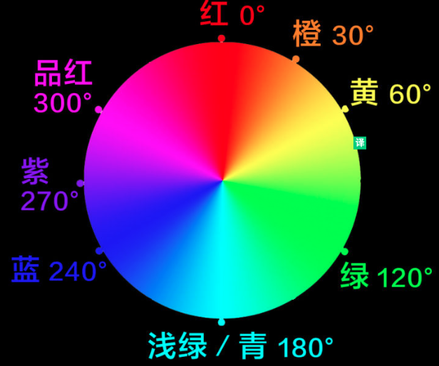

  饱和度：颜色的纯度（颜色深浅程度）

  亮度：颜色的明暗程度，亮度值越高，色彩越白，亮度越低，色彩越黑。

  例子：

  ```css
  div{
  	border:10px solid hsla(0,0%, 100%, 0.5);
  }
  ```

+ hsla()

#### 6. shim和polyfill

在 javascript 的世界里，我们经常会遇到`shim`和`polyfill`两个术语，那么它们之间到底有什么区别呢？

##### Shim

Shim 通常是一个代码库，它给旧环境（并不一定特指浏览器环境）带来的往往是全新的 api，而且这些 api 只能在这个环境当中运行。这个库中的方法接收的参数与调用方法与标准的方法一样，但是shim中的方法是自己实现逻辑处理的，因此在方法中加入了兼容性处理。所以方法的返回结果与标准方法相同。

##### Polyfill

在 2010年10月，Remy Sharp在他的博客中对 [polyfill](https://remysharp.com/2010/10/08/what-is-a-polyfill/) 做了如下定义：

> Polyfill 就是一系列的代码或者插件，它为开发者提供的技术特性，都是希望浏览器本就应该原生支持的，并且抹平了 api 之间的使用差异。

polyfill指的是符合shim标准的API。polyfill API使用老方法来实现新功能，从而保证在低级浏览器中也能使用比较新的方法。

因此，一个 polyfill 就是一个浏览器层面的 shim。典型地像检测浏览器是否支持某一个 api，如果不支持就加载一个 polyfill，这样就可以让开发者在任何情况下无缝的使用那些 api 了。Polyfill 这个术语其实来自于一款家居装修产品：

> Polyfilla 是英国生产的一种用来抹泥修墙的膏状物，它因能够很好地修复墙壁上的裂纹而被人们所熟知。所以，试想浏览器就相当于一堵有裂纹的墙，这些 polyfill 能够抹平墙壁上的裂纹，也就是浏览器之间的 api 差异，使开发者能够正常的在浏览器上使用这些技术特性。

可以理解为：“polyfill(n):一种JavaScript“衬垫”，用于在旧浏览器中提供标准API。”

因此，websocket polyfill会创建一个window.WebSocket对象，提供与原生实现相同的属性和方法。这意味着你可以使用真正API面向未来开发啦！只要在不支持该API的浏览器中加载兼容性polyfill即可。

举几个非常著名的例子：

一个是爱尔兰的 Paul 发布的 [html5 跨浏览器 polyfills](https://github.com/Modernizr/Modernizr/wiki/HTML5-Cross-browser-Polyfills)，里面收集了所有能够给浏览器植入 html5 功能的 polyfills 和 shims。

另一个是 [es5-shim](https://github.com/es-shims/es5-shim)，它在 ES3 引擎的基础上对 ES5 的很多特性进行了改进，因为纯粹是语言相关的，所以很多在 nodejs 上才能使用的特性在浏览器端同样能够运行。

实例1：

```
es5-shim.js/es5-shim-min.js:
```

作用：可以让一些低级的浏览器支持ES5中的一些特性。
注意： 由于es5-shim.js使用的是EMCScript的原生方法来实现的，因此必须放在所有外部导入js文件的最上面。

实例2：

```
es6-shim.js/es6-shim-min.js
```

作用：可以让一些低级的浏览器支持ES6中的一些特性。

实例3：

```JavaScript
require('es6-promise').polyfill();
//require(‘es6-promise/auto’);
```

作用：这个polyfill()方法能够在全局范围内处理promise方法。每当promise方法被调用，polyfill()方法就会自动修改为在低版本浏览器中也能处理的语法。

实例4：一个处理兼容性的例子:

```
html5shiv/html5shim:
```

由谷歌提供的html5.js能够让IE9以下的浏览器也能够正确处理html5中新增的几个标签。正确的调用方法如下：

```html
<!--[if lt IE 9]
    <script src="http://html5shiv.googlecode.com/svn/trunk/html5.js"></script>
<![endif]-->
```

注意：
1.这里的注释是不能删除的。这个条件注释用于检查当前浏览器版本是否低于IE9，只有当前浏览器版本低于IE9时，这个js文件才会被引入。
2.这个条件注释必须放在head标签能。因为IE浏览器必须在元素解析前知道这个元素。如果放在其他位置则会导致失效！
除此之外还需要在CSS样式表中添加一条样式：

```
header,section,footer,aside,nav,article,figure {
  display: block;
}
```


备注： 这条样式是为了让低版本的浏览器能够将html5中新增的标签当作块级元素来处理。否则低版本会将这些元素当作行级元素进行处理。

转载文章：

https://github.com/chenxiaochun/blog/issues/37

https://blog.csdn.net/sxLDWX/article/details/78963086

#### 7. 回退机制

在浏览器特性参差不齐的大环境下，“渐近增强” 与 “平稳退化” 是一种务实的策略。因此，在编写华丽样式的同时，我们还需要想好退路，为功能较弱的浏览器提供回退样式（fallback）。总的来说，我们应该利用 CSS 自身的机制来组织回退样式，而不是依赖 CSS hack 来实现。

**渐进增强**     VS   **优雅降级（平稳退化）**

**渐进增强（向上兼容）**：一开始就针对低版本浏览器进行构建页面，完成基本的功能，然后再针对高级浏览器进行效果、交互、追加功能达到更好的体验。

**优雅降级（向下兼容）**：一开始就构建站点的完整功能，然后针对浏览器测试和修复。比如一开始使用 CSS3 的特性构建了一个应用，然后逐步针对各大浏览器进行 hack 使其可以在低版本浏览器上正常浏览。

对比：

```css
.transition { /*渐进增强写法*/
  -webkit-transition: all .5s;
     -moz-transition: all .5s;
       -o-transition: all .5s;
          transition: all .5s;
}
.transition { /*优雅降级写法*/
          transition: all .5s;
       -o-transition: all .5s;
     -moz-transition: all .5s;
  -webkit-transition: all .5s;
}
```

回退写法：

举个例子，设计师要求某个元素的背景色显示为半透明的黑色（如上图所示）。但我们都知道，低版本 IE 等浏览器并不支持 RGBA 颜色，因此对于这些浏览器，我们需要将它的背景色设置为最接近设计意图的纯黑色。那么在这里，半透明黑色是我们期望的 “理想样式”，而纯黑色则是用来兜底的 “回退样式”。

在搞清楚状况之后，我们很快写出了下面的代码：

```css
div{
	background: rgba(0,0,0,0.75);
	background: #000\9;
}
```

这段代码的意图是这样的：第一条声明是我们理想的样式，写给标准浏览器；第二条声明是专门写给 IE 的 CSS hack，因为只有 IE 浏览器才能识别这一行，所以在 IE 下这个元素的背景色就是黑色的了。

听起来似乎很有道理，现实中也有很多代码就是这样写的，但它存在一些明显的缺陷：

- 首先，第二行代码命中的是 “IE 浏览器”，但实际上我们应该命中那些 “不支持 RGBA 的浏览器”。虽然从现状上来说，这两个集合的重合度相当高，但代码的作用和我们的实际意图不符，这是一个不小的问题。
- 此外，这种回退样式的写法在 IE6、7、8 当道的年代还算说得通，但当 IE9+ 出现之后就站不住脚了。因为 IE9+ 一方面是支持 RGBA 的，另一方面又可以识别第二条声明，最终导致 IE9+ 也把元素显示为纯黑背景（但它本可以显示出我们理想的效果）。在这里我们也可以看出 CSS Hack 的脆弱之处——没有人能对它的未来兼容性提供担保。

我们不妨换个思路，其实 CSS 有一项非常重要的 “向前兼容” 机制——当浏览器遇到无法识别的某行声明时，并不会报错或中止解析，只是默默地忽略它而已。（实际上 CSS Hack 之所以会起作用，也是利用了这个机制。）

因此，**正确的代码组织方式应该是先写 “回退样式”，再写 “理想样式”：**

```css
div{
	background: #000;
	background: rgba(0,0,0,0.75);
}
```

这种写法更像是具备了 “特性检测” 的功效：不支持 RGBA 的浏览器不识别第二条声明，因此只有第一条会生效；而对于支持 RGBA 的浏览器来说，它们可以同时识别这两条声明，但由于第二条声明的权重更高，这些浏览器最终将显示出半透明的效果。

总结：（1）通过样式的层叠提供完善的回退样式——浏览器前缀
​     （2）CSS向前兼容机制：先写回退样式，再写理想样式

转自：
http://www.10tiao.com/html/482/201604/2651552670/1.html
https://www.jianshu.com/p/d313f1108862

#### 8. IE滤镜

待补充....

#### 9. 渐变

【1】css渐变(专题) 

css3定义了两种渐变：**线性渐变（Linear Gradients）**or **径向渐变（Radial Gradients）**

- 线性渐变（linear-gradient） 
  - 第一个参数（方向，可忽略） 
    - 1. 默认第一个参数是从上到下（180deg）
    - 2. 如果有第一个参数(top/left/bottom/right)
    - 3. 使用角度也可以angle(角度值deg)进行控制
  - 第二个参数（颜色） 
    - 1. 可以使用英文字母进行颜色控制
    - 2. 可以使用16进制#RRGGBB进行颜色控制
    - 3. 使用rgb/rgba进行颜色控制
    - 4. 使用多个颜色控制
    - 5. 使用多个有指定范围的颜色控制
  - 线性渐变总写法

- 径向渐变（radial-gradient） 

  - 第一个参数中的第一个参数（半径，可忽略） 

    - 1. 第一个参数不写就默认从中间开始，样式为圆形

    - 2. 如果传一个值半径

    - 3 .如果传两个半径值

    - 4. 如果传关键字(closest-side/closest-corner/farthest-side/farthest-corner) 

      - 4.1 如果是圆形
      - 4.2 如果是椭圆

  - 第一个参数中的二个参数（形状，可忽略） 

    - 1. 如果只参数shape（circle,ellipse）
    - 2. 如果是加上长度范围和形状

  - 第一个参数中的第三个参数（方向，可忽略） 

    - 1. 如果第一个有参数(center/top/bottom/left/right)
    - 2. 如果方向为具体数值确定圆心
    - 3. 如果方向为百分比确定圆心

  - 第二个参数（颜色）

  - 径向渐变总写法

    ```
    linear-gradient([<angle> | to <side-or-corner>]? , <color-stop-list>)
    ```

- 兼容问题

- 特殊效果 

  - 进度条
  - 动画立体小球

渐变属性只有IE10以上才兼容，之后再讨论一下渐变的兼容问题

渐变属于背景图片中的一种，所以在css属性中，写background可以，写background-image 也可以，下面都是用background来写。

【2】线性渐变（linear-gradient）

1️⃣特点 ：就是向一个方向进行颜色渐变，上/下/左/右/对角线

2️⃣要素 ：方向，颜色（起始，终止，中间色）

3️⃣语法 ：

`linear-gradient([<angle>|to <side-or-corner>]?, color-start, color-stop1, ... , color-end);`

第一个参数是渐变的角度，接受一个表示角度的值（可用的单位deg、rad、grad或turn）或者是表示方向的关键词（top、right、bottom、left、left top、top right、bottom right或者left bottom）。

第二个参数是一系列颜色节点（终止点的颜色），注意：第一个为起色，最后一个为止色。

4️⃣线性渐变角度


5️⃣使用：

**第一个参数（方向，可忽略）**

①默认第一个参数如果不写就是从上到下的

```css
div{
    background: linear-gradient(hotpink, darkblue);
}
```

②参数为方向(top/left/bottom/right)

> to bottom(从上边开始)/to right(从左边开始)/to left(从右边开始)/to top(从下边开始)/
>
> to top left(从右下角开始)/to top right(从左下角开始)/to bottom left(从右上角开始)/to bottom right(从右下角开始)

③参数为angle(角度值deg)

> 0deg是to top的方向，顺时针是正，逆时针是负
>
> 0deg / 360deg （从下到上）/90deg （从左到右）/180deg （从上到下）/
>
> 270deg / -90deg （从右到左）/45deg （对角线左下到右上）

**第二个参数（颜色）**

①可以使用表示颜色的单词进行颜色控制（transparent）

②可以使用16进制#RRGGBB进行颜色控制

③使用rgb/rgba进行颜色控制

④使用多个颜色控制，只需要在后面加值即可

⑤使用多个有指定范围的颜色控制

在颜色后面加百分比，就可以控制在整个宽度的百分之多少的时候到达某一个颜色值

```
background: linear-gradient(#3a1c71, #d76d77,#ffaf7b); 
background: linear-gradient(#3a1c71, #d76d77 20% ,#ffaf7b 70%); 
background: linear-gradient(#3a1c71, #d76d77 80% ,#ffaf7b 90%); 
```

效果图： 


渐变线：

在渐变容器中，穿过容器中心点和颜色停止点连接在一起的线称为渐变线

渐变线长度：l=w*sin(a)+h*cos(a);

颜色纯色范围+渐变范围

**颜色停止点**

①若渐变只有两种颜色，且第一个颜色的位置设置为n%，第二个颜色的位置设置为m%。则浏览器会将0%-n%的范围设置为第一个颜色的纯色，n%-m%的范围设置为第一个颜色到第二个颜色的过渡，m%-100%的范围设置为第二个颜色的纯色

②若渐变颜色没有指定位置，则它们会均匀分布

③若多色占据同一个位置，例a、b、c三色均占据n%这一位置，则0%-n%为前一种颜色与a颜色的颜色渐变；然后是n%-n%的a颜色与c颜色的颜色突变；n%-100%是c颜色与后一种颜色的颜色渐变。因此，中间的b是无用的

```css
div{
    background-image: linear-gradient(red,yellow 50%,white 50%,black 50%,blue);
	//等价于上一个
	background-image: linear-gradient(red,yellow 50%,black 50%,blue);
}
```


**重复渐变**

重复渐变可以实现线性渐变的重复效果，使色标在渐变线方向上无限重复，实现一些特殊的效果，**重复渐变适用于斜线条纹**

[注意]只有当首尾两颜色位置不在0%或100%时，重复渐变才生效

重复渐变的好处：①减少了重复②线性条纹无法拆解时非常方便

例1：纸张效果，使用重复渐变可以实现横线纸张效果　　

```css
div{
    height: 200px;
    width:200px;
    font: 14px/20px '宋体';
    text-indent: 2em;
    background-image: -webkit-repeating-linear-gradient(#f9f9f9,#f9f9f9 9%,#ccc 10%);
    background-image: repeating-linear-gradient(#f9f9f9,#f9f9f9 9%,#ccc 10%);
}
```


例2：斜条纹


例3：

效果图：图2是将图1repeat了一遍


```html
<div class="test1"></div>    
<div class="test2"></div>
```

```css
.test1,.test2{
	background-image:
    linear-gradient(45deg,red 25%,transparent 25%),
    linear-gradient(-45deg,red 25%,transparent 25%),
    linear-gradient(45deg,transparent 75%,red 75%),
    linear-gradient(-45deg,transparent 75%,red 75%);
 }
.test2{
    background-size: 20% 20%;
}    
```

**线性渐变总写法**

> background: linear-gradient(to bottom,#3a1c71, #d76d77 80% ,#ffaf7b 90%); 

【3】径向渐变（radial-gradient）

1️⃣特点 ：一个中心点向外围进行颜色渐变

2️⃣要素 ：方向，形状，大小，颜色（起始，终止，中间色）

3️⃣语法 ：`background: radial-gradient(size shape at position,start-color, ..., last-color);`

4️⃣使用: 都是使用200px * 200px的div

**第一个参数中的第一个参数（半径，可忽略）**

①第一个参数不写就默认从中间开始，样式为圆形

②如果传一个值半径：圆

③如果传两个半径值：椭圆

④如果传关键字(**closest-side/closest-corner/farthest-side/farthest-corner**)

圆或者椭圆的相切的地方

圆：circle

closest-side：最近边；以最近的边到圆心的距离为半径

farthest-side：最远边；以最远的边到圆心的距离为半径

closest-corner：最近角； 以最近的角到圆心的距离为半径

farthest-corner：最远角；以最远的角到圆心的距离为半径

椭圆：ellipse

closest-side：最近边；以短边压缩

farthest-side：最远边；以最远的边到圆心的距离为长半径，圆心到最近的边的距离为短半径

closest-corner：最近角； 以最近的角到圆心的距离为半径

farthest-corner：最远角；以最远的角到圆心的距离为半径

+ 如果是圆形

```css
div{
    /*closest-side*/
    background: radial-gradient(closest-side,#ffaf7b, #d76d77 ,#3a1c71);
    /*40%只写一个表示40% 50%*/
    background: radial-gradient(closest-side circle at 40%,#ffaf7b, #d76d77 ,#3a1c71);  
    background: radial-gradient(closest-side circle at 20% 30%,#ffaf7b, #d76d77 ,#3a1c71);
    /*closest-corner*/
    background: radial-gradient(closest-corner,#ffaf7b, #d76d77 ,#3a1c71);
    background: radial-gradient(closest-corner circle at 40%,#ffaf7b, #d76d77 ,#3a1c71);
    background: radial-gradient(closest-corner circle at 20% 30%,#ffaf7b, #d76d77 ,#3a1c71);
    /*farthest-side*/
    background: radial-gradient(farthest-side,#ffaf7b, #d76d77 ,#3a1c71);
    background: radial-gradient(farthest-side circle at 40%,#ffaf7b, #d76d77 ,#3a1c71);
    background: radial-gradient(farthest-side circle at 20% 30%,#ffaf7b, #d76d77 ,#3a1c71);
    /*farthest-corner*/
    background: radial-gradient(farthest-corner,#ffaf7b, #d76d77 ,#3a1c71);
    background: radial-gradient(farthest-corner circle at 40%,#ffaf7b, #d76d77 ,#3a1c71);
    background: radial-gradient(farthest-corner circle at 20% 30%,#ffaf7b, #d76d77 ,#3a1c71);
}
```

效果图： 


+ 如果是椭圆

```css
div{
    /*closest-side*/
    background: radial-gradient(closest-side ellipse,#ffaf7b, #d76d77 ,#3a1c71);
    /*40%只写一个表示40% 50%*/
    background: radial-gradient(closest-side ellipse at 40%,#ffaf7b, #d76d77 ,#3a1c71);  
    background: radial-gradient(closest-side ellipse at 20% 30%,#ffaf7b, #d76d77 ,#3a1c71);
    /*closest-corner*/
    background: radial-gradient(closest-corner ellipse,#ffaf7b, #d76d77 ,#3a1c71);
    background: radial-gradient(closest-corner ellipse at 40%,#ffaf7b, #d76d77 ,#3a1c71);
    background: radial-gradient(closest-corner ellipse at 20% 30%,#ffaf7b, #d76d77 ,#3a1c71);
    /*farthest-side*/
    background: radial-gradient(farthest-side ellipse,#ffaf7b, #d76d77 ,#3a1c71);
    background: radial-gradient(farthest-side ellipse at 40%,#ffaf7b, #d76d77 ,#3a1c71);
    background: radial-gradient(farthest-side ellipse at 20% 30%,#ffaf7b, #d76d77 ,#3a1c71);
    /*farthest-corner*/
    background: radial-gradient(farthest-corner ellipse,#ffaf7b, #d76d77 ,#3a1c71);
    background: radial-gradient(farthest-corner ellipse at 40%,#ffaf7b, #d76d77 ,#3a1c71);
    background: radial-gradient(farthest-corner ellipse at 20% 30%,#ffaf7b, #d76d77 ,#3a1c71);
}
```

效果图： 


**第一个参数中的二个参数（形状，可忽略）**

+ 如果只参数shape（circle,ellipse）

如果div是正方形那么circle和ellipse并没有什么区别，但是如果是长方形，那么ellipse就会根据长度进行压缩

+ 如果是加上长度范围和形状

该范例要说明半径要写到形状前面，且半径作用大于形状

```css
div{
    background: radial-gradient(300px circle,hotpink, darkblue);
    background: radial-gradient(200px circle,hotpink, darkblue);
    background: radial-gradient(100px circle,hotpink, darkblue);
    background: radial-gradient(50px circle,hotpink, darkblue);
    background: radial-gradient(0px circle,hotpink, darkblue);

    /*如果这里加了长短轴的尺寸后面又写了circle，那么circle是不起作用的，出来还是一个椭圆*/
    background: radial-gradient(200px 50px ellipse,hotpink, darkblue);
}
```

**第一个参数中的第三个参数（方向，可忽略）**

+ 如果第一个有参数(center/top/bottom/left/right)

如果是原生写法记得要加at，而且对角线的时候上下和左右可以互换位置

+ 如果方向为具体数值确定圆心，可以是正数也可以是负数，可以超出范围

左边原点为左上角


3. 如果方向为百分比确定圆心

可以是整数也可以是负数，可以超出范围，方向和上面的一样

**第二个参数（颜色）**

只是径向渐变再算百分比的时候，颜色过渡是从内而外进行的

**径向渐变总写法**

>background: radial-gradient(100px circle at 75% 75%,#ffaf7b, #d76d77 20% ,#3a1c71 60%); background: radial-gradient(200px 100px ellipse at 25% 25%,#ffaf7b, #d76d77 60% ,#3a1c71 90%); 

【4】兼容问题

1. 第一步只需要添加私有前缀就可以解决。

   注意：标准语法要写在最下面，带有私有前缀的就不加to了，方向就是起始点

   >/*线性渐变*/
   >background: -webkit-linear-gradient(left, hotpink , darkblue); /* Safari 5.1 - 6.0 */
   >background: -o-linear-gradient(left, hotpink, darkblue); /* Opera 11.1 - 12.0 */
   >background: -moz-linear-gradient(left, hotpink, darkblue); /* Firefox 3.6 - 15 */
   >background: linear-gradient(to right, hotpink , darkblue); /* 标准的语法 */
   >/*径向渐变*/
   >background: -webkit-radial-gradient(center, hotpink , darkblue); /* Safari 5.1 - 6.0 */
   >background: -o-radial-gradient(center, hotpink, darkblue); /* Opera 11.1 - 12.0 */
   >background: -moz-radial-gradient(center, hotpink, darkblue); /* Firefox 3.6 - 15 */
   >background: radial-gradient(at center, hotpink , darkblue); /* 标准的语法 */

2. 第二步主要针对IE9以下的浏览器，是不支持渐变效果的。

   解决办法：使用IE私有的渐变滤镜

   ```
   filter:progid:DXImageTransform.Microsoft.gradient(startcolorstr=hotpink,endcolorstr=darkblue,gradientType=1);
   /**
   @ 第一个参数：startcolorstr 表示起始颜色（英文字母 or 十六进制）
   @ 第二个参数：endcolorstr 表示终止颜色（英文字母 or 十六进制）
   @ 第三个参数：gradientType 表示方向（1为横向渐变，0为纵向渐变）
   */
   ```

   ```css
   div{
   	/*50%透明度的#fc466b和50%透明度的#3f5efb*/
   	filter:progid:DXImageTransform.Microsoft.gradient(startcolorstr=#7ffc466b,
       	endcolorstr=#7f3f5efb,gradientType=1);/*兼容IE9以下*/
   	background: -webkit-linear-gradient(left, rgba(252,70,107,.5) , 
           rgba(63,94,251,.5));
       /* 标准的语法 */
   	background: -o-linear-gradient(left, rgba(252,70,107,.5) , rgba(63,94,251,.5)); 
       /* 标准的语法 */
   	background: -moz-linear-gradient(left, rgba(252,70,107,.5) , rgba(63,94,251,.5)); 	  /* 标准的语法 */
   	background: linear-gradient(to right, rgba(252,70,107,.5) , rgba(63,94,251,.5)); 	/* 标准的语法 */
   }
   ```

【5】特殊效果

1️⃣进度条动画

效果是什么样的？截图： 


分析：设置颜色渐变的角度、颜色和范围。然后设置从左到右的动画。该进度条是下面这个块的重复


实现：

```html
<div class="load"></div>
```

```css
body{
  margin:0;
  padding:0;
  /*为了展示方便就用灰色的背景*/
  background-color:#ccc;  
}

.load{
  width:500px;
  height:100px;
  /*如果渐变出不来，有一个背景颜色*/
  background:#fff;  
  margin:100px auto;
  /*间隔色的关键代码*/
  background-image:linear-gradient(
  	45deg,
    #fff 0%,
    #fff 25%,
    #000 25%,
    #000 50%,
    #fff 50%,
    #fff 75%,
    #000 75%,
    #000 100%
  );
  /*把刚才的背景压缩到100px * 100px以内的，没有设定不重复所以是重复的*/
  background-size: 100px 100px; 
  /*一秒播一次的永动动画*/
  animation: move 1s linear infinite; 
}

@keyframes move{
  0%{
    background-position:0px;
  }
  100%{
    background-position:100px;  /*终止状态是移动到100px像素的位置，然后下一秒又开始从0px开始运动*/
  }
}
```

2️⃣立体小球

效果图： 


分析：背景色设置一个，渐变是黑色的透明到不透明的渐变，外面的轮廓是圆。

```html
<div class="radial-gradient"></div>
```

```css
body {
  margin: 0;
  padding: 0;
  background-color: #F7F7F7;
}

.radial-gradient {
  width: 200px;
  height: 200px;
  margin: 40px auto;
  border-radius: 100px;
  background-color: hotpink; /*左边的没有背景色，右边的加了背景色*/
  background-image: radial-gradient(
    200px at 50px 60px,
    rgba(0, 0, 0, 0),
    rgba(0, 0, 0, 0.6)
  );
}
```

3️⃣文字穿过横线

效果图：


原理：

```html
<h2><span>立即注册</span></h2>
```

```css
h2{
   border: 1px solid red;
   text-align:center;
   line-height:50px;
   background:
   linear-gradient(transparent,transparent 49%,#000 49%,#000 51% ,transparent 51%);
}
span{
   padding:0 10px;
   background:#fff;
}
```

其他方案：利用的一个线性背景做x方向的重铺，然后中间也是用span标签做白色背景。

参考文章：

<https://juejin.im/post/5ad9d43951882567236e5133>

<https://www.cnblogs.com/xiaohuochai/p/5370446.html>

<https://juejin.im/post/5aa8f624f265da239d4900f0>

#### 10.border-image


### 笔记内容

#### 1.半透明边框

使用半透明颜色可能面临的问题：

+ 需要做好回退
+ 加载shim脚本
+ 在IE下用滤镜来hacknannan

题目：给容器设置一个白色背景和一个半透明的边框，父元素的背景色会从半透明的边框透过

效果图：
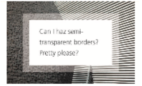

问题：透明边框不显示

关键点：背景和边框的关系

> 默认情况下，背景色会颜色到边框所在的区域

解决：**background-clip:padding-box;**

`background-clip`  设置元素的背景（背景图片或颜色）是否延伸到边框下面。取值：

```css
div{
	background-clip: border-box;
	background-clip: padding-box;
	background-clip: content-box;
}
```

#### 2.多重边框

方案一：box-shadow方案

优点：可以创建任意数量的投影

方案二：outline方案（两层边框）——常规边框+ouline

缺点：

+ 只适用于双层“边框”
+ outline属性实现的“边框”不会贴合元素的圆角
+ 需要在不同的浏览器下测试最终效果

#### 3.灵活的背景定位

方案一：background-position

方案二：background-origin

方案三：calc()

#### 4.边框内圆角

box-shadow+outline

tip：描边不会跟着元素的圆角走（显示出直角），但box-shadow会跟随圆角走，用box-shadow调补描边和容器圆角之间的空隙来实现内圆角

box-shadow的扩张值：小于描边的宽度，约等于圆角半径的一半


```css
.test{
     width: 150px;
     height: 150px;
     margin: 50px;
     background: red;
     box-shadow: 0 0 0 5px;
     border-radius: 10px;
     outline:10px solid black;
}
```

#### 5.条纹背景

①**重复渐变**  repeating-linear-gradient()

重复渐变可以实现线性渐变的重复效果，使色标在渐变线方向上无限重复，实现一些特殊的效果

重复渐变适用于斜线条纹

[注意]只有当首尾两颜色位置不在0%或100%时，重复渐变才生效

重复渐变的好处：①减少了重复②线性条纹无法拆解时非常方便

②同色系条纹

在大多数情况下，条纹图案并不是由差异极大的几种颜色组成的，这些颜色往往属于同一色系，只是在明度方面有轻微差异

例：

```css
div{
	background:repeating-linear-gradient(30deg,#79b,#79b 15px,#58a 0,#58a 30px);  
}
```

效果图：

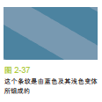

不足：第一，这两种颜色之间的关系没有体现出来;第二，想要改变这个条纹的主色调，需要修改四个地方。

优化：不为每种条纹单独指定颜色，而是把最深的颜色指定为背景色，同时把半透明白色的条纹叠加背景色上来得到浅色条纹

```css
div{
    background:#58a;
    background-image:
    	repeating-linear-gradient(30deg,hsla(0,0%,100%,.1),hsla(0,0%,100%,.1) 15px,transparent 0,transparent 30px)
}
```

#### 6.复杂的背景图案

#### 7.伪随机背景

#### 8.连续的图像边框

(1)background-image工作原理：

(2)连续的图像边框

①传统方法：连个HTML标签，一个元素用来把图片设置为背景，另一个元素用来存放内容，并设置为纯白色背景，然后覆盖在前者之上

```html
<div clase="something-meaningful">
	<div>I have a nice stone art border</div>
</div>
```

```css
.something-meaningful{
    /*background:url();*/
    background-size:cover;
    padding:1em;
}
.something-meaningful div{
    background:white;
    padding:1em;
}
```

问题：需要一个额外的标签，结构和表现混合了，某些特定场景下，无法修改HTML

解决：渐变

②渐变

原理：在石雕背景图片之上，叠加一层纯白色的实色背景。为了让下层的图片背景透过边框区域显示出来，需要给两层背景指定不同的background-clip值。只能在多重背景的底层设置背景色，用一到从白色过渡到白色的CSS渐变来模拟出纯白实色背景的效果

```css
div{
    padding:1em;
    border:1em solid transparent;
    background:linear-gradient(white,white);
               /*url()*/
    background-size:cover;
    background-clip:padding-box,border-box;
    background-origin:border-box;
}
```

(3)信封效果

问题：条纹有折

效果图：

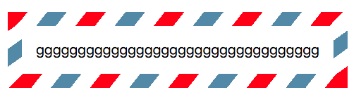


## 第三章	形状

### 知识仓库

#### 1.圆角border-radius

基础图形：


属性值：


边框大小和内外半径


外径：x =100px    y=100px

内径：x= 100-40=60px     y=100-20=80px

#### 2.变形transform属性和变形原点transform-origin属性

transform: 改变元素在页面中的**大小**，**位置**，**角度**和**形状**

【1】兼容性：属性加前缀

```css
div{
  transform: rotate(45deg);
  transform-origin: 0 0;
  -ms-transform: rotate(45deg);     /* IE 9 */
  -ms-transform-origin: 0 0;          
  -moz-transform: rotate(45deg);    /* Firefox */
  -moz-transform-origin: 0 0; 
  -webkit-transform: rotate(45deg); /* Safari Opera and Chrome */ 
  -webkit-transform-origin: 0 0;
}
```

【2】坐标图

2D坐标：

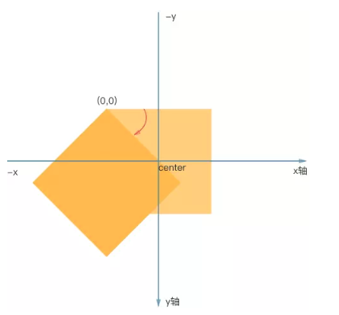

3D坐标：


【3】transform-origin变形原点

设置对象变换的原点，通常和rotate旋转、scale缩放、skew斜切等一起使用，**IE9+**

2D情况下：默认值 50% 50%，即center center

3D情况下：默认值 50% 50% 0

取值介绍：

1. X轴：left｜center｜right｜length｜%
2. Y轴：top｜center｜bottom｜length｜%
3. Z轴：length

注意：如果只设置一个值，则该值作用于横坐标，纵坐标默认50%，Z轴默认为0，另外百分比是相对于自身进行计算的。

【4】transform变形

+ **位移**

**属性：transform**

函数——**translate(x)** ：元素在x轴上的位移距离，x为必须值，y默认为0，值为正右移动，值为负左移动

​               **translate(x,y) **：x表示x轴位移距离，y表示y轴位移距离，值为正向下移动，值为负向上移动

​               **translateX(x)** ：只改变元素在x轴上的位置

​               **translateY(y)** ：只改变元素在y轴上的位置

​               **translateZ(z)**：指定Z轴的位移;

​               **translate3D(x,y,z)**：第一个参数指定X轴的位移量, 第二个参数指定Y轴的位移量, 第三个参数指定Z轴的位移量, 3个参数缺一不可;

取值：1、数值 2、百分比

使用translate时需要注意位移量的百分比是相对元素**自身宽高**来计算的。

translate有一个最常见的应用，即当元素宽度高度不固定时，使用translate可实现水平以及垂直方向的居中。

```html
<div class="translate">
    <div class="child">

    </div>
</div>
```

```css
.translate{
    width: 200px;
    height: 300px;
    border: 1px solid red;
    margin: 10px auto;
    position:relative;
}
.translate .child{
    position: absolute;
    top: 50%;
    left: 50%;
    background-color: yellow;
    padding: 50px;
    transform: translate(-50%,-50%);
}
```

+ **缩放**

属性：**transform**

函数——**scale(value)**：如果只给一个值，那么x轴和y轴将等比缩放

​                **scale(x,y)**：改变 x轴和y轴的缩放比例

​                **scaleX(x)**：只改变x轴的缩放比例

​                **scaleY(y)**：只改变y轴的缩放比例

​		**scaleZ()**：指定Z轴的缩放倍数;

​		**scale3D()**： 第一个参数指定X轴的缩放倍数, 第二个参数指定Y轴的缩放倍数, 第三个参数指定Z轴的缩放倍数, 3个参数缺一不可;

 取值：默认值 为1，缩小：0~1 之间的数值，放大：大于1的数值

注意：

  1.参数值是是分别相对于元素的宽高进行计算的，即便只设置了一个值，也是分别计算的

2. 参数为负值时，除了方向方式改变，其他与正值相同，如果设置scale(-1.5)，x轴，y轴都会旋转


+ **旋转**

属性：**transform**

函数：**rotate(ndeg)**：2D旋转，**为绕Z轴旋转**

​	    **rotateX()**: 指定X轴的旋转角度;

​            **rotateY()**: 指定Y轴的旋转角度;

​            **rotateZ()**: 指定Z轴的旋转角度; 

​	    **rotate3D()**: 3D旋转，必须指定四个参数，前3个参数分别表示旋转的方向x y z, 第4个参数表示旋转的角度;

取值：n取值为正，则顺时针旋转；n取值为负，则逆时针旋转

注意：1、转换时，坐标轴会一起进行转换

​            2、转换原点可以影响转换效果

​	    3、x,y,z,如果取值为 0的话，说明该轴不参与旋转

​                  x,y,z,如果取值为 1的话，说明该轴是参与旋转的

​                 rotate3d(0,0,1,45deg)-- rotatez(45deg)

​	    4、x轴旋转：前后旋转，y轴旋转：侧面旋转，z轴旋转：平面旋转

**2D旋转：如果不加perspective，X轴选择高度减小，Y轴旋转宽度减小**


3D旋转：加perspective，x轴旋转为为梯形，y轴旋转为侧梯形

效果图如下：

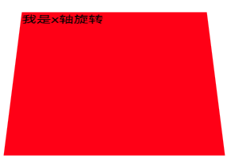

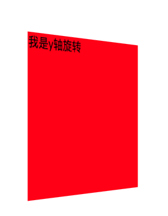

**2D倾斜**：正方形可变成菱形

属性：**transform**

函数：**skew(xdeg)** : x轴倾斜指定角度，实际上时改变 y轴的倾斜角度，第一个参数对应X轴[必须]，

​                                    第二个参数对应Y轴[当不设置时, 默认为0；

​                                    取值为正：逆时针，取值为负：顺时针

​           **skewX(xdeg)** : 效果同上

​           **skewY(ydeg)** : y轴倾斜指定角度，实际上是改变 x轴的倾斜角度

​                                      取值为正：顺时针，取值为负：逆时针

#### 3.形状属性

【1】形状函数：左上角为(0,0)点，使用%，x以长度为准，y以宽度为准

长方形：inset(上,右,下,左)，参数为：现对于父元素的偏移量值

​        圆：circle(半径 at 圆心)，圆心为左上角

​    椭圆：ellipse(长半径 短半径 at 圆心)，圆心为左上角

多边形：polygon(x1 y1,x2 y2,x3 y3.....)

【2】形状属性

**shape-outside**：限制形状周围的内容

**shape-inside**：限制形状内部的内容

​	可以把shape-margin和shape-outside属性结合使用，定义形状周围的margin，以此隔开浮动的内容和形状，在形状和内容之间留出更多的空间。与shape-outside和shape-margin对应一样，shape-inside有对应的shape-padding属性，用来添加内间距。

**clip-path属性** ：可以创建一个只有元素的部分区域可以显示的剪切区域。区域内的部分显示，区域外的隐藏。

【3】定义一个形状

一行代码就可以使用Shape属性和函数来定义一个形状：

```css
.element {
    shape-outside: circle(); /* content will flow around the circle defined on the element */
}
```

或者：

```text
.element {
    shape-outside: url(path/to/image-with-shape.png);
}
```

但是，要让这行CSS生效，必须满足两个条件：

- **元素必须是浮动的。**新版的CSS Shape可以循序我们定义一个非浮动元素的形状，但是现在还不行；
- **元素必须有确定的尺寸。**元素的宽度和高度被用来建立这个元素上的坐标系统。

看上面函数的定义，形状都是由一组坐标定义的。因为这些点是坐标，所以需要坐标系统，这样浏览器才知道把这些点放在元素的什么位置上。因此，加上下面这段代码上面的例子就可以正常工作。

```css
.element {
    float: left;
    height: 10em;
    width: 15em;
    shape-outside: circle();
}
```

【4】Shape的Reference Box

CSS Shape在一个Reference Box（参考框）里被定义和创建，这个Box用来绘制在元素上的形状。除了元素的宽高之外，元素的和模型——外边界Box、内容Box、内边界Box和边框Box——也会作为元素上形状大小的参考。

默认把外边界Box作为参考——因此，如果你应用了形状的元素的底部有外边界，则形状会延伸到外边jie上，而不是元素的边框区域。如果你想使用其他Box值，你可以在形状函数之后指定，然后传递给Shape属性。

```css
.ele{
    shape-outside: circle(250px at 50% 50%) padding-box;
}
```

上面这条规则中的padding-box关键字，把形状限定在了元素的内边框Box中。circle()函数定义了一个环状的形状，包括这个形状的大小和在这个元素上的位置。

【5】使用Shape函数定义Shape

例子：把信息环绕在圆形的头像上开始，我们常常在用户信息或者推荐中用到


```html


<p>Lorem ipsum dolor sit amet, consectetur adipisicing elit. Harum itaque nam blanditiis eveniet enim eligendi quae adipisci?</p>

<p>Assumenda blanditiis voluptas tempore porro quibusdam beatae deleniti quod asperiores sapiente dolorem error! Quo nam quasi soluta reprehenderit laudantium optio ipsam ducimus consequatur enim fuga quibusdam mollitia nesciunt modi.</p>
```

①使用border-radius让图片变圆——我们通常都是这样让图片等其他元素变圆的

```text
img {
    float: left;
    width: 150px;
    height: 150px;
    border-radius: 50%;
    margin-right: 15px;
}
```


原因：border-radius无法影响元素周围或者内部的内容的布局。它只能影响元素的边框和背景。背景区域会被裁剪成圆角，但是它功能仅限于此。元素内部的内容任然是矩形的，而且周围的内容还是把元素当做一个矩形的存在——本质上它还是。不添加CSS Shape，文本任然把图片当做矩形的，因此还是围绕成一个矩形，而不是圆的。

②使用CSS Shape，让文本环绕圆形的用户头像。文本将不再是长方形的。

为了改变内容布局以适应特定的形状，我们使用Shape属性和circle()函数给头像添加一个圆形：

```css
img {
    float: left;
    width: 150px;
    height: 150px;
    border-radius: 50%;

    shape-outside: circle();
    shape-margin: 15px;
}
```

这样，文本会看到一个圆的形状在图片上，环绕之。在不支持CSS Shape属性的浏览器中，原型图片周围的内容就像环绕在一个不是圆形的图片周围。这就是在较老浏览器中CSS Shape降级的效果。

【6】circle()

> circle() = circle( [<shape-radius>]? [at <position>]? )

问号标示这些参数是可选的。省略的参数将会被浏览器使用默认值补全。如果你直接使用circle()而未指定圆形的位置，它会定义一个放在元素正中间的圆形。

你可以指定圆形的半径，什么单位都可以（px、em、pt等等）。你甚至可以指定使用closest-side或者furthest-side作为半径，closest-side是默认值，即浏览器会把从中点到最近边的长度作为圆形的半径。furthest-side则是使用中心到最远边的距离。

```css
div{
    shape-outside: circle(farthest-side at 25% 25%); 
    /* defines a circle whose radius is half the length of the longest side, positioned at the point of coordinates 25% 25% on the element’s coordinate system*/

	shape-inside: circle(250px at 500px 300px);
    /* defines a circle whose center is positioned at 500px horizontally and 300px vertically, with a radius of 250px */
}
```


【7】inset()

inset()函数再元素内部创建一个矩形。既然元素本身就是矩形的，我们当然不需要更多的矩形。inset()实际上可以帮助我们在元素内部创建一个带有圆角的矩形。文本内容可以环绕在圆角周围。


inset()函数接受1到4个值指定从参考Box边缘向内的距离。这可以控制这个矩形在元素内部的位置。这个函数还接受一个可选参数，设置内部矩形的圆角。且圆角的设置于border-radius的方法一致，使用一到四个值，于关键字round结合在一起。

```text
inset() = inset( offset{1,4} [round <border-radius>]? )
```

在一个浮动的元素中创建一个带圆角的矩形：

```css
.element {
    float: left;
    width: 250px;
    height: 150px;
    shape-outside: inset(0px round 100px) border-box;
}
```

【8】polygon()，它可以是用任意数量的点来定义更加复杂的形状。这个函数接受一系列的坐标，每个坐标定义多边形的一个边角，合在一起组成整个图形。

在下面的例子中，一张右浮动的图片使用viewport单位，占满了整个屏幕。我们希望左侧的文本可以沿着图片内部的沙漏浮动，因此，我们使用polygon()函数在图片上定义了一个不规则的的图形。


图片的CSS：

```css
img.right {
    float: right;
    height: 100vh;
    width: calc(100vh + 100vh/4);
    shape-outside: polygon(40% 0, 100% 0, 100% 100%, 40% 100%, 45% 60%, 45% 40%);
}
```

你可以使用长度单位或者百分比来定义边角的坐标，我使用的是百分比。

这段代码就是显示出图片的效果，你可以看到，Shape函数无法影响形状外的图片。事实上，一个形状除了影响内容的浮动之外无法对元素造成其他任何影响，不管这个元素是图片还是容器或者其他的什么。

为了让我们创建的多边形更有存在感，我们需要把形状之外的图片抠掉。这就需要[CSS Masking模块](https://link.zhihu.com/?target=http%3A//www.w3.org/TR/2014/WD-css-masking-1-20140213/)的clip-path属性来帮忙了。

clip-path属性接受同样的Shape函数和参数座位形状属性。如果我们把传递给shape-outside的多边形传递给clip-path属性，它会把形状之外的图片全部抠掉。

```css
img.right {
    float: right;
    height: 100vh;
    width: calc(100vh + 100vh/4);
    shape-outside: polygon(40% 0, 100% 0, 100% 100%, 40% 100%, 45% 60%, 45% 40%);
    /* clip the image to the defined shape */
    clip-path: polygon(40% 0, 100% 0, 100% 100%, 40% 100%, 45% 60%, 45% 40%);
}
```

看效果：


目前，使用clip-path还需要使用前缀，这个例子clip-path使用了-webkit-前缀，因此可以在Chrome中工作，你点击查看[demo](https://link.zhihu.com/?target=http%3A//codepen.io/SaraSoueidan/pen/04a4c8380e4aa5a8e6a2b0014b2db198/)。

clip-path属性确实是Shape属性的好伙伴，因为它可以帮助凸显被创建的形状，抠掉元素上所有不再形状内部的部分。你自然会经常发现把clip-path个Shape属性结合使用。

polygon()函数还接受一个可以可选的参数fill，有两个值，nonzero和even odd。指明如何对待多边形自己内部的交错区域。更多信息可以查看[SVG fill-rule](https://link.zhihu.com/?target=http%3A//www.w3.org/TR/SVG/painting.html%23FillRuleProperty)。

【9】使用图片定义Shape

使用图片来确定一个形状，需要用到这张图片的alpha通道，浏览器可以据此提取出图形。

像素的alpha通道的值是否超过某个临界值，这是定义形状的依据。默认的临界值是0.0（完全透明），你也可以通过shape-image-threshold属性来定义。因此，所有不透明的像素点都是形状的一部分。

有可能，新版的CSS Shape不但可以使用alpha通道，还可以使用亮度。果真如此的话，shape-image-threhold将被扩展，支持亮度或者alpha通道，基于不同状态间的切换。

我们将使用下面这张图，定义元素的形状，让文本环绕之：


使用shape-outside属性，传递一个url()值，指向我们想要的图片。

```text
.leaf-shaped-element {
    float: left;
    width: 400px;
    height: 400px;
    shape-outside: url(leaf.png);
    shape-margin: 15px;
    shape-image-threshold: 0.5;
    background: #009966 url(path/to/background-image.jpg);
    mask-image: url(leaf.png);
}
```

当然，如果元素有背景图片的话，需要把形状之外的部分去掉。不过clip-path无法接受一张带透明度的图片座位参数，我们 可以使用Masking Module的mask-image（需要对应的前缀）属性来实现。看看效果：


如果你需要创建一个复杂的形状，推荐你使用图片来定义。你可以通过Photoshop来定义alpha通道，比起手动指定定点方便多了。

文章参考：

<https://zhuanlan.zhihu.com/p/19774074>

[CSS Shapes 101 · An A List Apart Article](https://link.zhihu.com/?target=http%3A//alistapart.com/article/css-shapes-101)

文章参考：<https://www.jianshu.com/p/5acba7c4a7ad>


### 笔记内容

#### 1.自适应椭圆

不指定宽度和高度

```css
div{
    border-radius: 50% / 50%;
	//简化：
	border-radius: 50%;
}
```

#### 2.半椭圆


分析：

【1】这个形状是垂直对称的， 所以左上角和右上角的半径值是相同的； 与此类似，左下角和右下角的半径值也是相同的。顶部边缘并没有平直的部分（ 也就是说， 整个顶边都是曲线），左上角和右上角的半径之和应该等于整个形状的宽度，左半径和右半径在水平方向上的值均为50%。

【2】再看看垂直方向， 顶部的两个圆角占据了整个元素的高度， 而且底部完全没有任何圆角。 因此， 在垂直方向上border-radius  就是100% 100% 0 0。

```css
div{
    width: 300px;
    height: 200px;
    border:20px red solid;
    margin: 20px auto;
    /*border-radius: 50% 50% 0 0/100% 100% 0 0;*/
    /*简化:*/
   border-radius: 50%/100% 100% 0 0;
}
```

#### 3.四分之一椭圆

 其中一个角的水平和垂直半径值都需要是100%， 而其他三个角都不能设为圆角

```css
div{
    width: 300px;
    height: 200px;
    border:20px red solid;
    margin: 20px auto;
    border-radius: 100% 0 0 0;
}
```

糖果按钮：<http://simurai.com/archive/buttons/>

#### 4.平行四边形

效果图：


```
<div class="btn">Home</div>
```

```css
    .btn{
        width: 150px;
        height: 40px;
        text-align: center;
        line-height: 40px;
        background-color: #fb3;

        transform: skew(-45deg);

        -moz-transform: skew(-45deg);
        -ms-transform: skew(-45deg);
        -webkit-transform: skew(-45deg);
    }
```

实际图：


方法一：比较常见的，**嵌套一层结构，父元素进行斜切，子元素抵消掉斜切**。

```html
<div class="wrap">
    <div class="pxsbx1">
            我是平行四边形1
    </div>
</div>
```

```css
.wrap{
    width: 200px;
    height: 60px;
    background-color: red;
    text-align: center;
    line-height: 60px;
	transform: skew(-45deg);
}
.pxsbx1{
    transform: skew(45deg);
}
```

方法二：**使用伪元素，将斜切背景应用在伪元素上**

```html
<div class="pxsbx2">我是平行四边形2</div>
```

```css
.pxsbx2{
     position: relative;
     width: 200px;
     height: 60px;
     text-align: center;
     line-height: 60px;
}
.pxsbx2:after{
     content: '';
     position: absolute;
     top: 0;
     left: 0;
     /*width: 100%;*/
     /*height: 100%;*/
     bottom:0;
     right:0;
     background-color: red;
     z-index: -1;
     transform: skew(-45deg);
}
```

#### 5.菱形

方法一：rotate结合scale，首先对父级进行旋转，然后缩放

```html
<div class="box">
    
</div>
```

```css
/*基本样式设计：*/
.box{
	width: 200px;
    height: 200px;
    border: 1px solid;
    overflow: hidden;
    transform: rotate(45deg) scale(1.41);
}
.box img{
    width: 100%;
}
```

效果图：


缩放后效果图：图片的宽度等于容器对角线的宽度


缺点：需要额外的标签，本身有限制，每次都要计算scale的放大比例，且当图片不是正方形时，就没办法实现较好的菱形效果。

方法二：裁切路径方案(推荐)，不需要嵌套任何元素。

原理：根据裁切路径将元素裁剪为任何形状

polygon():多边形函数，参数为4个点坐标  

```css
img{
	clip-path: polygon(0 50%, 50% 0, 100% 50%, 50% 100%);
}
```

效果图：


缺点：浏览器支持程度有限

#### 6.切角效果

【1】切一个角

效果图：


```html
<div class="qiejiao1">只切一个角</div>
```

```css
.qiejiao1{
   width: 200px;
   height: 200px;
   background: red;/*回退机制*/
   background: linear-gradient(-45deg,transparent 25px,#58a 0);
}
```

【2】切两个角

原理：**多个liner-gradient是相互覆盖的，先设置的在上**，切两个角需要左右各一个bg

效果图：


```css
		.qiejiao3{
            width: 200px;
            height: 200px;
            background: red;
            background:
                    linear-gradient(45deg,transparent 10%,red 10%) left,
                    linear-gradient(-45deg,transparent 10%,blue 10%) right;
            -webkit-background-size: 50% 100%;
            background-size: 50% 100%;
            background-repeat: no-repeat;
            margin-bottom: 10px;
        }
```


【3】切四个角

原理：切四个角需要4个bg

效果图：


```css
       .qiejiao4{
            width: 200px;
            height: 200px;
            background: red;
            background:
                    linear-gradient(45deg,transparent 10%,red 10%) left bottom,
                    linear-gradient(-45deg,transparent 10%,blue 10%) right bottom,
                    linear-gradient(135deg,transparent 10%,yellow 10%) left top,
                    linear-gradient(-135deg,transparent 10%,orange 10%) right top;

            -webkit-background-size: 50% 50%;
            background-size: 50% 50%;
            background-repeat: no-repeat;
            margin-bottom: 10px;
        }
```

#### 7.梯形

和平行四边形的原理一样，梯形的背景仍要写在伪元素上，以防止字体变形。

2D旋转：如果不加perspective，X轴选择高度减小，Y轴旋转宽度减小

效果图：


```html
<div class="box">home</div>
```

```css
基本样式
.box {
    position: relative;
    width: 200px;
    height: 60px;
    margin: 50px;
    line-height: 60px;
    text-align: center;
}
.box:after {
    /*用伪元素生成一个矩形*/
    content: '';
    position: absolute;
    top: 0;left: 0;right: 0;bottom: 0;
    z-index: -1; 
    background-color: #fb3; /*回退机制*/
    transform: perspective(20px) rotatex(5deg);

    -moz-transform: perspective(20px) rotatex(5deg);
    -ms-transform: perspective(20px) rotatex(5deg);
    -webkit-transform: perspective(20px) rotatex(5deg);
}  
```

为更好的查看效果，可以给box加上半透明的背景，效果图：

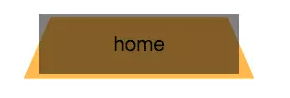

优化1：旋转是以元素的中心线进行旋转的，所以要修改一下旋转原点

```css
div:after {
	transform-origin: bottom;
	－moz-transform-origin: bottom;
	-ms-transform-origin: bottom;
	-webkit-transform-origin: bottom;
}
```

这样会导致高度严重缩水效果图：


优化2：使用scale进行y轴的缩放

```css
div:after{
    transform: perspective(20px) rotatex(5deg) scaleY(1.3);
}
```

拓展：利用修改transform-origin的值实现不同的梯形


```css
div{
	/*右侧直角*/
	transform-origin: right;
	transform: perspective(20px) rotatex(5deg);

	/*左侧直角*/
	transform-origin: left;
	transform: perspective(20px) rotatex(5deg);
}
```

实例：梯形标签页

效果图：

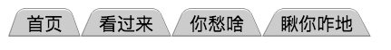

```css
        .tixing-nav a{
            display: inline-block;
            position: relative;
            padding: .3em 1em 0;
        }
        .tixing-nav a:before{
            content: '';
            position: absolute;
            top: 0;
            left: 0;
            right: 0;
            bottom: 0;
            z-index: -1;

            background: #ccc;
            /*background: linear-gradient(hsla(0,0%,100%,.6),hsla(0,0%,100%,.6));*/
            border: 1px solid rgba(0,0,0,.4);
            transform: perspective(.5em) rotateX(5deg) scaleY(1.3);
            transform-origin: bottom;
            border-radius:8px 8px 0 0 ;
            box-shadow: 0 .1em white inset;
            /*让tab看起来有立体感*/
        }
```

## 第四章	视觉效果

### 知识仓库

#### 1.box-shadow阴影效果

高斯模糊：使用高斯模糊算法（ 或类似算法） 将阴影进行4px  的模糊处理。 这在本质上表示在阴影边缘发生阴影色和纯透明色之间的颜色过渡长度近似于模糊半径的两倍（ 比如在这里是8px）。

 如果给元素设置一层半透明的背景，我们就看不到它下层有任何投影。这一点跟text-shadow 不同，因为文字下层的投影不会被裁切。  

   见第二章知识仓库

#### 2.滤镜filter属性


### 笔记内容

#### 1.单侧投影

原理：使用负的扩展半径，且刚好等于模糊半径

```css
div{
	box-shadow: 0 5px 4px -4px black;  
}
```

效果图：

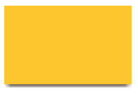

#### 2.邻边投影

方法一：使用与模糊半径相等的偏移量来隐藏顶部和左侧的投影

方法二：扩张半径设为模糊半径的相反值一半，„ 指定两个偏移量， 它们的值需要大于或等于模糊半径的一半。

#### 3.双侧投影

原理：因为扩张半径在四个方向上的作用是均等的（ 也就是说， 我们无法指定投影在水平方向上放大， 而在垂直方向上缩小）， 唯一的办法是用两块投影（每边各一块） 来达到目的。 ( 把“单侧投影” 中的技巧运用两次)

#### 4.不规则投影

 给一个矩形或其他能用border-radius生成的形状加投影时，box-shadow 的表现都堪称完美。 但当元素添加了一些伪元素或半透明的装饰之后， 它就有些力不从心了， 因为**box-shadow 会忽视透明部分**。 这类情况包括：

+ 半透明图像、 背景图像、 或者border-image（ 比如老式的金质像框）；

+ 元素设置了点状、 虚线或半透明的边框， 但没有背景（ 或者当background-clip  不是border-box  时）;
+ 对话气泡， 它的小尾巴通常是用伪元素生成的；

+ 切角形状；
+ 折角效果
+ 通过 clip-path  生成的形状， 比如“菱形图片”。

效果图：

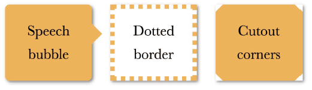

解决：filter属性——滤镜效果


#### 5.染色效果

#### 6.毛玻璃效果

#### 7.折角

效果图：

```html
<div class="box"></div>
```

```css
	.box{
        position: relative;
        background-color: #58a; /*hack 回退*/
        background: linear-gradient(-150deg, transparent 30px, yellowgreen 0);
    }

    .box:before {
        position: absolute;
        content: '';
        width: 62px;
        height: 34px;
        top: 0;
        right: 0;
        background: linear-gradient(-30deg, transparent 30px, rgba(0, 0, 0, .7) 0);
        transform: rotate(-120deg); 
   }
```


## 第五章	字体排印

### 知识仓库

### 笔记内容

#### 1.连字符断行

#### 2.插入换行

#### 3.文本行的斑马条纹

#### 4.调整tab 的宽度

#### 5.连字

#### 6.华丽的& 符号

#### 7.自定义下划线

#### 8.现实中的文字效果

#### 9.环形文字

## 第六章	用户体验

### 知识仓库

#### 1.CSS3——滤镜filter

**filter** 属性将模糊或颜色偏移等图形效果应用于元素。滤镜通常用于调整图像，背景和边框的渲染。

+ url(resources.svg#c1)

  URL函数接受一个XML文件，该文件设置了 一个SVG滤镜，且可以包含一个锚点来指定一个具体的滤镜元素。

+ 模糊：blur(<length>)

+ 对比度：contrast(<number-percentage>)

+ 亮度：brightness(<number-percentage>)

+ 阴影：drop-shadow(<length>){2,4}? color)

+ 灰度：grayscale(<number-percentage>)

+ 褐色：sepia(<number-percentage>)

+ 饱和度：saturate(<number-percentage>)

+ 色相旋转：hue-rotate(<angle>)

+ 反色：invert(<number-percentage>)

+ 透明度：opacity(<number-percentage>

### 笔记内容

#### 1.使用合适的鼠标光标

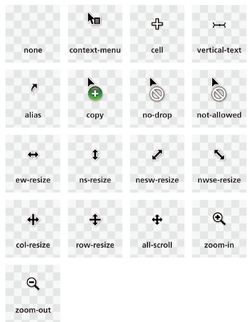

**提示禁用状态**

```css
:disabled, [disabled], [aria-disabled="true"] {
	cursor: not-allowed;
}
```

**隐藏鼠标光标**——隐藏鼠标光标确实能带来可用性的提升

场景：① 公共触摸屏（ 比如公共场所的信息查询台， 飞机椅背上的娱乐系统）②视频播放时

在CSS 2.1 中，隐藏光标需要用到一张1×1 的透明GIF 图片

```css
video {
	cursor: url("");
	/*内容为：url - transparent.gif*/
}
```

在CSS 2.1 中

```css
video{
    cursor:none;
}
```

不过，还是有必要提供一个回退方案，因为旧版浏览器可能还不认识这些新的光标关键字。我们可以利用层叠机制来实现这一点：

```css
video{
    /*cursor: url("");*/
    /*内容为：transparent.gif*/
	cursor: none;
}
```

#### 2.扩大可点击区域（热区）

方法一： 扩张热区最简单的办法是为它设置一圈透明边框， 因为鼠标对元素边框的交互也会触发鼠标事件

```css
button{
    border: 10px solid transparent;
    /*背景在默认情况下会蔓延到边框的下层。background-clip属性可以把背景限制在原本的区域之内*/
	background-clip: padding-box;
    /*用内嵌投影来模拟出一道（实色）边框*/
    box-shadow: 0 0 0 1px rgba(0,0,0,.3) inset;	
}
```

问题：想给按钮添加外阴影的时候，外部投影却是绘制在border box 外部的，会产生怪异效果

方法二：伪元素——：伪元素同样可以代表其宿主元素来响应鼠标交互

```css
button {
	position: relative;
	/* [其余样式] */
}
button::before {
	content: '';
	position: absolute;
	top: -10px; right: -10px;
	bottom: -10px; left: -10px;
}
```

#### 3.自定义复选框


#### 4.通过阴影来弱化背景

很多时候， 我们需要通过一层半透明的遮罩层来把后面的一切整体调暗， 以便凸显某个特定的UI  元素， 引导用户关注。 比如， 弹出层以及交互式的“ 快速指南” 就是这种效果的典型案例。 

方法一：常见方法——是**增加一个额外的HTML 元素用于遮挡背景**

```css
.overlay { /* 用于遮挡背景 */
	position: fixed;
	top: 0;
	right: 0;
	bottom: 0;
	left: 0;
	background: rgba(0,0,0,.8);
}
.lightbox { /* 需要吸引用户注意的元素 */
    position: absolute;
	z-index: 1;   
}
```

 这个方法稳定可靠 ，但需要增加一个额外的HTML 元素 ，这意味着该效果无法由CSS 单独实现 。这不是一个很严重的问题 ，但对我们来说又确实是个麻烦事 。

方法二：伪元素

①将遮罩层加在body的伪元素上

```
body.dimmed::before {
	position: fixed;
	top: 0;
	right: 0;
	bottom: 0;
left: 0;
z-index: 1;
background: rgba(0,0,0,.8);
}
```

这个办法确实有一定改善，因为我们可以直接在CSS 层面使用这个效果了。

问题：这个方法的可移植性还不够好，因为body 元素上可能有其他需求已经占用了::before 伪元素；而且在使用这个效果时，我们往往还需要一点JavaScript 来给body 添加dimmed 这个类。

②将遮罩层加在元素的伪元素上

这解决了可移植性的问题，但无法对遮罩层的Z 轴层次进行细粒度的控制。它可能会出现在这个元素之后（这是我们期望的），但也可能会出现在这个元素的父元素或祖先元素之后。


伪元素方法存在的问题：伪元素无法绑定独立的JavaScript 事件处理函数。当遮罩层是由一个独立的元素来实现时，我们可以给它绑定事件处理函数，比如当用户点击遮罩层时自动关闭弹出层。当使用弹出层自己的伪元素来实现遮罩层时，就需要判断用户到底是点了弹出层还是遮罩层。

方法三：box-shadow方案

对于简单的应用场景和产品原型来说，可以利用box-shadow 来达到调暗背景的效果：box-shadow 的扩张参数可以把元素的投影向各个方向延伸放大。具体做法就是生成一个巨大的投影，不偏移也不模糊，简单而拙劣地模拟出遮罩层的效果。

```css
div{
    box-shadow: 0 0 0 50vmax rgba(0,0,0,.8);
}
```

问题1： 无法在较大的屏幕分辨率（>2000px） 下正常工作。 要么加大数字来缓解这个问题， 要么换用视口单位来一劳永逸地解决它， 这样才能确保“ 遮罩层”总是 可以覆盖（ 甚至超出） 视口。 因为无法分开指定水平和垂直方向上的扩张半径， 所以此处最合适的视口单位是vmax。1vmax  相当于1vw  和1vh  两者中的较大值。100vw  等于整个视口的宽度，100vh  就是视口的高度。 因此， 满足我们需求的最小值就是50vmax。 由于投影是同时向四个方向扩展的， 这个遮罩层的最终尺寸将是100vmax  加上元素本身的尺寸。

问题2：遮罩层的尺寸是与视口相关而不是与页面相关的，滚动页面时，遮罩层的边缘就露出来了， 除非给它加上position: fixed; 或者页面并没有长到需要滚动的程度。此外，由于页面很可能真的很长，为了规避这个缺陷而扩大投影的扩张半径就不太明智了。 实际中应该有限度地应用这个技巧， 比如配合固定定位来使用， 或者当页面没有滚动条时再用。

问题3：第二，当使用一个独立的元素（或伪元素）来实现遮罩层时，这个遮罩层不仅可以从视觉上把用户的注意力引导到关键元素上，还可以防止用户的鼠标与页面的其他部分发生交互，因为遮罩层会捕获所有指针事件。boxshadow并没有这种能力，因此它只能在视觉上起到引导注意力的作用，却无法阻止鼠标交互

方法四：backdrop 方案

缺点：兼容性问题，支持有限

#### 5.通过模糊来弱化背景

原理： 用一个额外的HTML  元素来实现这个效果，需要把页面上除了关键元素之外的一切都包裹起来， 这样就可以只对这个容器元素进行模糊处理了。<main>  元素在这里是极为合适的， 因为它可以发挥一箭双雕的作用： 把页面中的主要内容标记出来（ 对话框通常都不是主要内容）， 同时还给了我们添加样式的钩子

```html
<main>Bacon Ipsum dolor sit amet...</main>
<dialog>
	O HAI, I'm a dialog. Click on me to dismiss.
</dialog>
<!-- 其他对话框都写在这里 -->
```

 它并没有配备遮罩层。 每当弹出一个对话框， 都需要给main元素增加一个类， 以便对它应用模糊滤镜：

```css
main.de-emphasized {
	filter: blur(5px);
}
```

优化：

```css
main {
	transition: .6s filter;
}
main.de-emphasized {
	filter: blur(3px) contrast(.8) brightness(.8);
}
```

缺点： 着一旦滤镜不被支持 ，没有任何回退方案 。可使用box-shadow方案来实现阴影效果

#### 6.滚动提示


#### 7.交互式的图片对比控件


## 第七章	结构与布局

### 知识仓库

### 笔记内容

#### 1.自适应内部元素

 如果不给元素指定一个具体的height， 它就会自动适应其内容的高度。如何实现宽度的自适应

#### 2.精确控制表格列宽

#### 3.根据兄弟元素的数量来设置样式

#### 4.满幅的背景，定宽的内容

#### 5.垂直居中

#### 6.紧贴底部的页脚

## 第八章	过渡与动画

### 知识仓库

#### 1.transition 过渡

+ 过渡属性`transition-property`

+ 过渡时间`transition-duration`

+ 过渡函数`transition-timing-function`

  （1）ease：逐渐放慢

  （2）linear：匀速

  （3）ease-in：加速

  （4）ease-out：减速

  （5）cubic-bezier函数：自定义速度模式

  使用工具网站来定制：[http://cubic-bezier.com](http://cubic-bezier.com/)

+ 延迟时间 `transition-delay`

transition的优点在于简单易用，但是它有几个很大的局限。

（1）transition需要事件触发，所以没法在网页加载时自动发生。

（2）transition是一次性的，不能重复发生，除非一再触发。

（3）transition只能定义开始状态和结束状态，不能定义中间状态，也就是说只有两个状态。

CSS Animation就是为了解决这些问题而提出的。

#### 2.动画animation

默认是：

- 动画名称`animation-name`: `none`

- 动画持续时间`animation-duration`: `0s`

- 动画函数`animation-timing-function`: `ease`

- 动画延迟`animation-delay`: `0s`

- 动画重复次数`animation-iteration-count`: `<number>`|`infinite`

- 动画方向`animation-direction`——指示动画是否反向播放: `normal` |` reverse `| `alternate` | `alternate-reverse`

  + `normal`：每个循环内动画向前循环，即：每个动画循环结束，动画重置到起点重新开始，默认属性。
  + `reverse`：反向运行动画，每周期结束动画由尾到头运行。
  + `alternate`：动画交替反向运行，反向运行时，动画按步后退，同时，带时间功能的函数也反向
  + 

- 动画完成模式`animation-fill-mode`: `none`|`forwards`|`backwards`|`both`

- 动画播放状态`animation-play-state`: `running`|`paused`


### 笔记内容

#### 1.缓动效果

 回弹效果是指当一个过渡达到最终值时， 往回倒一点， 然后再次回到最终值， 如此往复一次或多次， 并逐渐收敛， 最终稳定在最终值。

举个例子，假设要用一个元素来模拟一个下落的小球，我们会把transform 属性1①从none 过渡到translateY(350px) 来模拟这个下落过程。

有相当多的JavaScript 类库可以创建动画，且内置回弹效果

#### 2.逐帧动画


#### 3.闪烁效果


#### 4.打字动画


#### 5.状态平滑的动画


#### 6.沿环形路线平移的动画

